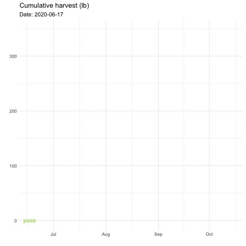
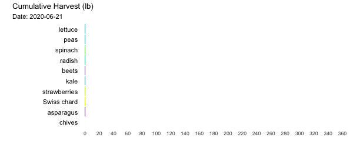

## Set up

Set options
```{r setup, include=FALSE}
knitr::opts_chunk$set(echo = TRUE, 
                      message = FALSE, 
                      warning = FALSE)
```

Load libraries
```{r library}
library(tidyverse)     # for data cleaning and plotting
library(googlesheets4) # for reading googlesheet data
library(lubridate)     # for date manipulation
library(gganimate)     # for adding animation layers to ggplots
library(transformr)    # for "tweening" (gganimate)
library(gifski)        # for creating the gif (don't need to load this library every time,but need it installed)
library(maps)          # for map data
library(ggmap)         # for mapping points on maps
library(RColorBrewer)  # for color palettes
library(sf)            # for working with spatial data
library(ggthemes)      # for more themes (including theme_map())
gs4_deauth()           # To not have to authorize each time you knit.
theme_set(theme_minimal())
```

Load data
```{r data}
# Lisa's garden data
garden_harvest <- read_sheet("https://docs.google.com/spreadsheets/d/1DekSazCzKqPS2jnGhKue7tLxRU3GVL1oxi-4bEM5IWw/edit?usp=sharing") %>% 
  mutate(date = ymd(date))

# Lisa's Mallorca cycling data
mallorca_bike_day7 <- read_csv("https://www.dropbox.com/s/zc6jan4ltmjtvy0/mallorca_bike_day7.csv?dl=1") %>% 
  select(1:4, speed)

#COVID-19 data from the New York Times
covid19 <- read_csv("https://raw.githubusercontent.com/nytimes/covid-19-data/master/us-states.csv")

```

## Example 1

Prep data
```{r}
cum_harvest_subset <- garden_harvest %>% 
  filter(vegetable %in% c("tomatoes", "beans", 
                          "peas", "zucchini")) %>% 
  group_by(vegetable, date) %>% 
  summarize(daily_harvest_lb = sum(weight)*0.00220462) %>% 
  mutate(cum_harvest_lb = cumsum(daily_harvest_lb))

cum_harvest_subset
```

Static plot
```{r}
cum_harvest_subset %>% 
  ggplot(aes(x = date, 
             y = cum_harvest_lb)) +
  geom_point() +
  facet_wrap(vars(vegetable)) +
  labs(title = "Cumulative harvest (lb)", 
       x = "",
       y = "")
```

Replace faceting with animation and save plot (note `eval=FALSE`)
```{r, eval=FALSE}
cum_harvest_subset %>% 
  ggplot(aes(x = date, 
             y = cum_harvest_lb)) +
  geom_point() +
#  facet_wrap(vars(vegetable)) +
  labs(title = "Cumulative harvest (lb)", 
       x = "",
       y = "") +
  transition_states(states = vegetable)

anim_save(___)
```

Reload the animation
```{r, echo=FALSE}
knitr::include_graphics(___)
```

Customize!
```{r}
anim_state_custom <- 
  cum_harvest_subset %>% 
  ggplot(aes(x = date, 
             y = cum_harvest_lb,
             group = vegetable,
             color = vegetable,
             shape = vegetable)) +
  geom_point() +
  scale_color_manual(values = c("tomatoes" = "darkred",
                                "beans" = "springgreen4",
                                "peas" = "yellowgreen",
                                "zucchini" = "darkgreen")) +
  labs(title = "Cumulative harvest (lb)", 
       subtitle = "Vegetable: {next_state}",
       x = "",
       y = "") +
  theme(legend.position = "none") +
  transition_states(vegetable, 
                    transition_length = 2, 
                    state_length = 1) +
  enter_grow() +
  exit_fade()
  
animate(anim_state_custom, 
        nframes = 100, 
        width = 300, 
        height = 300)

anim_save("anim_state_custom.gif")
```

## Example 2

Create static plot:

```{r}
cum_harvest_subset %>% 
  ggplot(aes(x = date, 
             y = cum_harvest_lb,
             color = vegetable)) +
  geom_line() +
  labs(title = "Cumulative harvest (lb)", 
       x = "",
       y = "",
       color = "vegetable") +
  scale_color_manual(values = c("tomatoes" = "darkred",
                       "beans" = "springgreen4",
                       "peas" = "yellowgreen",
                       "zucchini" = "darkgreen")) +
  theme(legend.position = "top",
        legend.title = element_blank())
```

Animate the plot with some extras:

```{r eval=FALSE, echo=FALSE}
cum_harvest_subset %>% 
  ggplot(aes(x = date, 
             y = cum_harvest_lb,
             color = vegetable)) +
  geom_line() +
  geom_text(aes(label = vegetable)) +
  labs(title = "Cumulative harvest (lb)", 
       subtitle = "Date: {frame_along}",
       x = "",
       y = "",
       color = "vegetable") +
  scale_color_manual(values = c("tomatoes" = "darkred",
                       "beans" = "springgreen4",
                       "peas" = "yellowgreen",
                       "zucchini" = "darkgreen")) +
  theme(legend.position = "none") +
  transition_reveal(date)
```

Save it:

```{r}
anim_save("cum_veg.gif")
```

Read it back in:

```{r}

```

## Racing veggies!

Mostly get data prepped (you'll see I didn't do everything I needed to do):

```{r}
cum_harvest_all_dates <- garden_harvest %>% 
  group_by(date, vegetable) %>% 
  summarize(daily_harvest_lb = sum(weight)*0.00220462) %>% 
  ungroup() %>% 
  complete(date, vegetable) %>% 
  arrange(vegetable,date) %>% 
  group_by(vegetable) %>% 
  replace_na(list(daily_harvest_lb = 0)) %>% 
  mutate(cum_harvest_lb = cumsum(daily_harvest_lb)) %>% 
  filter(cum_harvest_lb > 0)
```

Do a little more data prep and create static plot:

```{r}
cum_harvest_all_dates %>% 
  group_by(date) %>% 
  filter(n()>=10) %>% 
  top_n(n = 10, wt = cum_harvest_lb) %>% 
  arrange(date, cum_harvest_lb) %>% 
  mutate(rank = 1:n()) %>% 
  filter(date %in% seq(ymd("2020-06-21"), ymd("2020-09-20"), by = "weeks")) %>% 
  ggplot(aes(x = cum_harvest_lb,
             y = factor(rank),
             fill = vegetable)) +
  geom_col() +
  geom_text(aes(label = vegetable),
            x = -10,
            hjust = "right") +
  facet_wrap(vars(date), scales = "free_y") +
  scale_x_continuous(limits = c(-100,NA),
                     breaks = c(seq(10,100,10),seq(100,400,20))) +
  labs(title = "Cumulative Harvest (lb)",
       x = "", 
       y = "") +
  theme(axis.line = element_blank(), 
        panel.grid = element_blank(),
        axis.text.y = element_blank(),
        legend.position = "none") +
  scale_fill_viridis_d()
```

Let the races begin!

```{r, eval=FALSE}
racing_veggies <- cum_harvest_all_dates %>% 
  group_by(date) %>% 
  filter(n()>=10) %>% 
  top_n(n = 10, wt = cum_harvest_lb) %>% 
  arrange(date, cum_harvest_lb) %>% 
  mutate(rank = 1:n()) %>% 
  ggplot(aes(x = cum_harvest_lb,
             y = factor(rank),
             fill = vegetable,
             group = vegetable)) +
  geom_col() +
  geom_text(aes(label = vegetable),
            x = -10,
            hjust = "right") +
  scale_x_continuous(limits = c(-80,NA),
                     breaks = c(seq(0,400,20))) +
  labs(title = "Cumulative Harvest (lb)",
       subtitle = "Date: {frame_time}",
       x = "", 
       y = "") +
  theme(axis.line = element_blank(), 
        panel.grid = element_blank(),
        axis.text.y = element_blank(),
        legend.position = "none") +
  scale_fill_viridis_d() +
  transition_time(date)

animate(racing_veggies, 
        nframes = 200, 
        duration = 15,
        width = 600,
        height = 250)
anim_save("racing_veggies.gif")
```

```{r, echo=FALSE}

```

## Bike ride

```{r, eval=FALSE}
mallorca_map <- get_stamenmap(
    bbox = c(left = 2.28, bottom = 39.41, right = 3.03, top = 39.8), 
    maptype = "terrain",
    zoom = 11
)

ggmap(mallorca_map) +
  geom_path(data = mallorca_bike_day7, 
             aes(x = lon, y = lat, color = ele),
             size = .5) +
  geom_point(data = mallorca_bike_day7, 
             aes(x = lon, y = lat),
             color = "red") +
  scale_color_viridis_c(option = "magma") +
  theme_map() +
  theme(legend.background = element_blank()) +
  transition_reveal(along = time) +
  labs(title = "Lisa's Long Ride",
       subtitle = "Time: {frame_along}")

anim_save("lisa_bike.gif")
```

```{r}
knitr::include_graphics("lisa_bike.gif")
```

## COVID

Prep data
```{r}
census_pop_est_2018 <- read_csv("https://www.dropbox.com/s/6txwv3b4ng7pepe/us_census_2018_state_pop_est.csv?dl=1") %>% 
  separate(state, into = c("dot","state"), extra = "merge") %>% 
  select(-dot) %>% 
  mutate(state = str_to_lower(state))

states_map <- map_data("state")

state_map_covid <- covid19 %>% 
  mutate(state = str_to_lower(state),
         weekday = wday(date, label = TRUE)) %>% 
  filter(weekday == "Fri") %>% 
  left_join(census_pop_est_2018,
            by = c("state" = "state")) %>% 
  mutate(cum_cases_per_10000 = (cases/est_pop_2018)*10000) %>% 
  inner_join(states_map,
             by = c("state" = "region")) 
```


Create animation using `transition_time()`
```{r}
state_map_covid %>% 
  ggplot() +
  geom_polygon(aes(x = long, 
                   y = lat, 
                   group = group,
                   fill = cum_cases_per_10000)) +
  expand_limits(x = state_map_covid$long, 
                y = state_map_covid$lat) + 
  scale_fill_distiller(palette = "YlGnBu", 
                       direction = 1,
                       labels = scales::comma_format()) +
  labs(title = "Cumulative COVID-19 cases per 10,000",
       subtitle = "Date: {frame_time}",
       fill = "",
       caption = "Viz by @lisalendway") +
  theme_map() +
  theme(legend.background =  element_blank(),
        plot.background =  element_rect("gray50"),
        legend.text = element_text(color = "white")) +
  transition_time(date)

anim_save("covid_map_poly.gif")
```
```
```{r}
knitr::include_graphics("covid_map_poly.gif")
```
