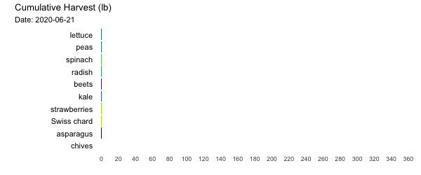
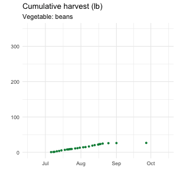
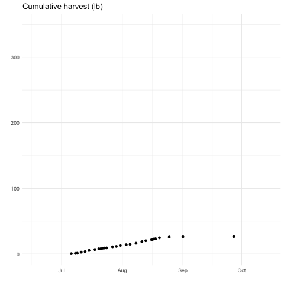
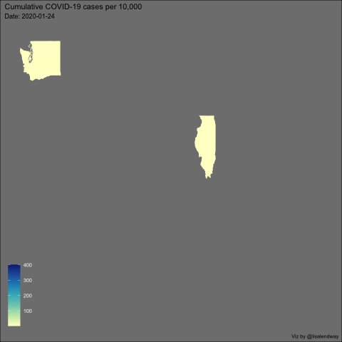

```{css, echo = FALSE}
.remark-code {
  font-size: 18px;
}
.huge .remark-code { /*Change made here*/
  font-size: 200% !important;
}
.tiny .remark-code { /*Change made here*/
  font-size: 60% !important;
}
```


```{r setup, include=FALSE}
options(htmltools.dir.version = FALSE)
knitr::opts_chunk$set(echo = FALSE, 
                      message = FALSE, 
                      warning = FALSE)
```

```{r library}
library(tidyverse)     # for data cleaning and plotting
library(googlesheets4) # for reading googlesheet data
library(lubridate)     # for date manipulation
library(gganimate)     # for adding animation layers to ggplots
library(transformr)    # for "tweening" (gganimate)
library(gifski)        # for creating the gif (don't need to load this library every time,but need it installed)
library(maps)          # for map data
library(ggmap)         # for mapping points on maps
library(RColorBrewer)  # for color palettes
library(sf)            # for working with spatial data
library(ggthemes)      # for more themes (including theme_map())
library(xaringan)      # for slides
library(xaringanExtra) # for extra slide tools
library(flair)         # for highlighting code
library(downloadthis)  # for adding download buttons
xaringanExtra::use_panelset()
gs4_deauth()           # To not have to authorize each time you knit.
theme_set(theme_minimal())
```

```{r data}
# Lisa's garden data
garden_harvest <- read_sheet("https://docs.google.com/spreadsheets/d/1DekSazCzKqPS2jnGhKue7tLxRU3GVL1oxi-4bEM5IWw/edit?usp=sharing") %>% 
  mutate(date = ymd(date))

# Lisa's Mallorca cycling data
mallorca_bike_day7 <- read_csv("https://www.dropbox.com/s/zc6jan4ltmjtvy0/mallorca_bike_day7.csv?dl=1") %>% 
  select(1:4, speed)

#COVID-19 data from the New York Times
covid19 <- read_csv("https://raw.githubusercontent.com/nytimes/covid-19-data/master/us-states.csv")

```

# Goals

```{r, echo=FALSE}

```

---

background-image: url(gganimate.png)
background-size: cover
background-position: 50% 50%
class: left, top


---
background-image: url(garden.png)
background-size: cover
background-position: 50% 50%
class: left, top, inverse

## Data: Hello #junglegarden


---

## Data (Raw)

```{r}
garden_harvest
```

---

## Data (summarized subset)

```{r}
cum_harvest_subset <- garden_harvest %>% 
  filter(vegetable %in% c("tomatoes", "beans", 
                          "peas", "zucchini")) %>% 
  group_by(vegetable, date) %>% 
  summarize(daily_harvest_lb = sum(weight)*0.00220462) %>% 
  mutate(cum_harvest_lb = cumsum(daily_harvest_lb))

cum_harvest_subset
```


---

## What do we need?

```{r, eval=FALSE, echo=TRUE}
library(tidyverse)     # for data cleaning and plotting
library(googlesheets4) # for reading googlesheet data
library(lubridate)     # for date manipulation
library(gganimate)     # for adding animation layers to ggplots
library(transformr)    # for "tweening" (gganimate)
library(gifski)        # for creating the gif (don't need to load this library every time,but need it installed)
gs4_deauth()           # To not have to authorize each time you knit.
```


---

## Do it with me!

Follow along by downloading this file:

```{r, echo=FALSE}
download_file(
  path = "gganimate_pres_demo.Rmd",
  button_label = "Download gganimate demo file",
  button_type = "warning",
  has_icon = TRUE,
  icon = "fa fa-save",
  self_contained = FALSE
)
```

---

## Goal Plot

```{r, echo=FALSE}

```


---

### 1. Static `ggplot()`

.panelset[
.panel[.panel-name[R Code]

```{r static-plot, eval=FALSE, echo=FALSE}
cum_harvest_subset %>% 
  ggplot(aes(x = date, 
             y = cum_harvest_lb)) +
  geom_point() +
  facet_wrap(vars(vegetable)) +
  labs(title = "Cumulative harvest (lb)", 
       x = "",
       y = "")
```

```{r, echo=FALSE}
decorate_chunk("static-plot", eval=FALSE) %>% 
  flair("facet_wrap(vars(vegetable)) +")
```

]

.panel[.panel-name[Plot]

```{r, fig.height=8, fig.asp=.5}
cum_harvest_subset %>% 
  ggplot(aes(x = date, 
             y = cum_harvest_lb)) +
  geom_point() +
  facet_wrap(vars(vegetable)) +
  labs(title = "Cumulative harvest (lb)", 
       x = "",
       y = "")
```

]
]

---

### 2. Add animation layer: `transition_states()`

.panelset[
.panel[.panel-name[R Code]

```{r animate1, eval=FALSE, echo=FALSE}
cum_harvest_subset %>% 
  ggplot(aes(x = date, 
             y = cum_harvest_lb)) +
  geom_point() +
#  facet_wrap(vars(vegetable)) +
  labs(title = "Cumulative harvest (lb)", 
       x = "",
       y = "") +
  transition_states(states = vegetable)
```

```{r eval=FALSE}
anim_save("veg_t_states.gif")
```

```{r}
decorate_chunk("animate1", eval=FALSE) %>% 
  flair("facet_wrap(vars(vegetable)) +") %>% 
  flair("transition_states(states = vegetable)")
```

]

.panel[.panel-name[Plot]


```{r, fig.width=4}
knitr::include_graphics("veg_t_states.gif", dpi = 300)
```

]
]


---

### 2. Let's try again

.panelset[
.panel[.panel-name[R Code]

```{r animate2, eval=FALSE, echo=FALSE}
cum_harvest_subset %>% 
  ggplot(aes(x = date, 
             y = cum_harvest_lb,
             group = vegetable)) +
  geom_point() +
  labs(title = "Cumulative harvest (lb)", 
       x = "",
       y = "") +
  transition_states(states = vegetable)
```

```{r eval=FALSE}
anim_save("veg_t_states2.gif")
```


```{r, echo=FALSE}
decorate_chunk("animate2", eval=FALSE) %>% 
  flair("group = vegetable")
```

]

.panel[.panel-name[Plot]

```{r}

```

]
]

---

### 4. Save & 5. Display

.panelset[
.panel[.panel-name[Save current]
````markdown
`r ''````{r eval=FALSE}
cum_harvest_subset %>% 
  ggplot(aes(x = date, 
             y = cum_harvest_lb,
             group = vegetable)) +
  geom_point() +
  labs(title = "Cumulative harvest (lb)", 
       x = "",
       y = "") +
  transition_states(states = vegetable)
anim_save("veg_t_states2.gif")
```
````
]

.panel[.panel-name[Save named]

````markdown
`r ''````{r eval=FALSE}
my_gif <- cum_harvest_subset %>% 
  ggplot(aes(x = date, 
             y = cum_harvest_lb,
             group = vegetable)) +
  geom_point() +
  labs(title = "Cumulative harvest (lb)", 
       x = "",
       y = "") +
  transition_states(states = vegetable)
anim_save("veg_t_states2.gif", my_gif)
```
````

]

.panel[.panel-name[Reload]


````markdown
`r ''````{r}

```
````

]
]

---

### 3. Customize!

.panelset[
.panel[.panel-name[R Code]

.tiny[
```{r anim-state-custom, eval=FALSE, echo=TRUE}
anim_state_custom <- 
  cum_harvest_subset %>% 
  ggplot(aes(x = date, 
             y = cum_harvest_lb,
             group = vegetable,
             color = vegetable, #<<
             shape = vegetable)) + #<<
  geom_point() +
  scale_color_manual(values = c("tomatoes" = "darkred", #<<
                                "beans" = "springgreen4", #<<
                                "peas" = "yellowgreen", #<<
                                "zucchini" = "darkgreen")) + #<<
  labs(title = "Cumulative harvest (lb)", 
       subtitle = "Vegetable: {next_state}", #<<
       x = "",
       y = "") +
  theme(legend.position = "none") +
  transition_states(vegetable, 
                    transition_length = 2, #<<
                    state_length = 1) + #<<
  enter_grow() + #<<
  exit_fade() #<<
  
animate(anim_state_custom, #<<
        nframes = 100, #<<
        width = 300, #<<
        height = 300) #<<
```
]

```{r, eval=FALSE}
anim_save("anim_state_custom.gif")
```

]

.panel[.panel-name[Plot]

```{r}

```


]
]

---

## Example with `transition_reveal()`

```{r}
knitr::include_graphics("cum_veg.gif")
```

---

## Racing veggies!

```{r, echo=FALSE}

```

---

## Mapping a bike ride

```{r, eval=FALSE}
mallorca_map <- get_stamenmap(
    bbox = c(left = 2.28, bottom = 39.41, right = 3.03, top = 39.8), 
    maptype = "terrain",
    zoom = 11
)

ggmap(mallorca_map) +
  geom_path(data = mallorca_bike_day7, 
             aes(x = lon, y = lat, color = ele),
             size = .5) +
  geom_point(data = mallorca_bike_day7, 
             aes(x = lon, y = lat),
             color = "red") +
  scale_color_viridis_c(option = "magma") +
  theme_map() +
  theme(legend.background = element_blank()) +
  transition_reveal(along = time) +
  labs(title = "Lisa's Long Ride",
       subtitle = "Time: {frame_along}")

anim_save("lisa_bike.gif")
```

```{r}
knitr::include_graphics("lisa_bike.gif")
```

---

## Mapping COVID-19 in the US by state


```{r}

```


---

## Resources

* [Lisa's tutorial](https://animation-and-interactivity-in-r.netlify.app/#Adding_animation_with_gganimate)

* [gganimate intro slides](https://goodekat.github.io/presentations/2019-isugg-gganimate-spooky/slides.html) by Katherine Goode (she animates bats flying!)

* [gganimate cheatsheet](https://ugoproto.github.io/ugo_r_doc/pdf/gganimate.pdf)

* [gganimate by Thomas Pedersen](https://github.com/thomasp85/gganimate) - scroll down to the bottom  
* [Pedersen introductory vignette](https://cran.r-project.org/web/packages/gganimate/vignettes/gganimate.html) - gives a brief intro to what each of the key functions do  
* [gganimate wiki page](https://github.com/thomasp85/gganimate/wiki) - most of this is currently under development but there's some good examples  

* [ropensci examples](https://github.com/ropenscilabs/learngganimate)
